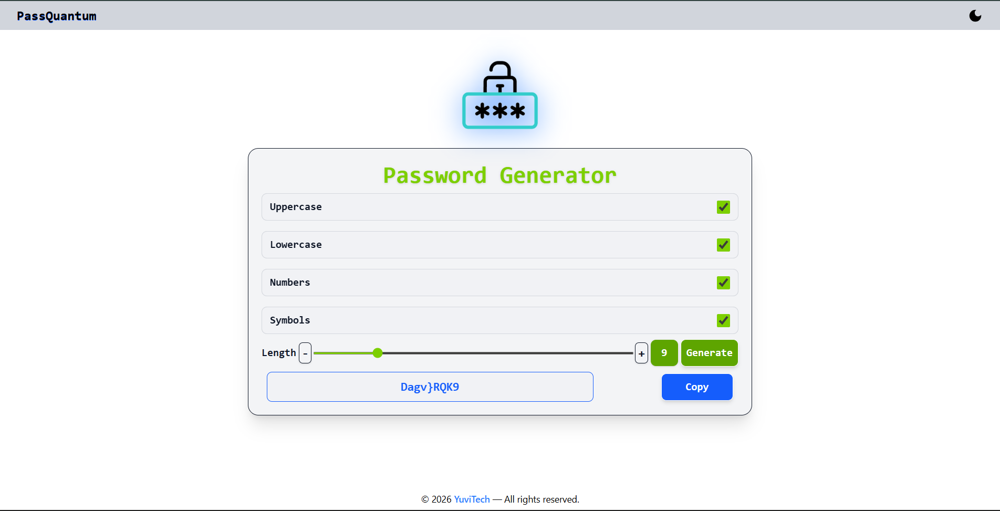

# 🔐 PassQuantum

PassQuantum is a modern and secure **password generator web application** designed to create strong, customizable passwords instantly.  
It helps users improve their online security by generating highly secure passwords with flexible options and a clean, user-friendly interface.

---

## 🚀 Live Demo

🔗 https://passquantum.vercel.app  
*(Replace with your actual deployed link)*

---

## 📸 Preview

="

---

## ✨ Features

- 🔑 Generate strong and secure passwords  
- 🔢 Customizable password length  
- 🔠 Include uppercase & lowercase letters  
- 🔣 Include numbers and special characters  
- 📋 One-click copy to clipboard  
- 📱 Fully responsive design  
- ⚡ Fast and lightweight performance  

---

## 🛠 Tech Stack

- **React.js**
- **Tailwind CSS**
- **JavaScript (ES6+)**
- **Vite**

---

## 📦 Installation & Setup

Follow these steps to run the project locally:

### 1️⃣ Clone the Repository

```bash
git clone https://github.com/YRJ03/PassQuantum.git
```

### 2️⃣ Navigate to Project Folder

```bash
cd PassQuantum
```

### 3️⃣ Install Dependencies

```bash
npm install
```

### 4️⃣ Start Development Server

```bash
npm run dev
```

The app will run on:

```
http://localhost:5173
```

---

## 🔐 Security Note

PassQuantum generates passwords locally in the browser.  
No passwords are stored, tracked, or transmitted to any server.

---

## 🚀 Deployment

You can deploy PassQuantum easily on:

- **Vercel**
- **Netlify**
- **GitHub Pages**

To create a production build:

```bash
npm run build
```

Deploy the generated `dist` folder.

---

## 🔮 Future Improvements

- 🌙 Dark mode toggle  
- 📊 Password strength indicator  
- 💾 Save generated passwords locally  
- 🔐 Option to exclude similar characters  
- 📱 PWA support  

---

## 🤝 Contributing

Contributions are welcome!

1. Fork the repository  
2. Create your feature branch  
3. Commit your changes  
4. Push to the branch  
5. Open a Pull Request  

---

## 👨‍💻 Author

**Yuvraj Yadav**  
Full Stack Web Developer  
Built with ❤️ using React & Tailwind CSS  

GitHub: https://github.com/YRJ03  

---

## 📜 License

This project is licensed under the **MIT License**.

---

⭐ If you like this project, don’t forget to star the repository!
